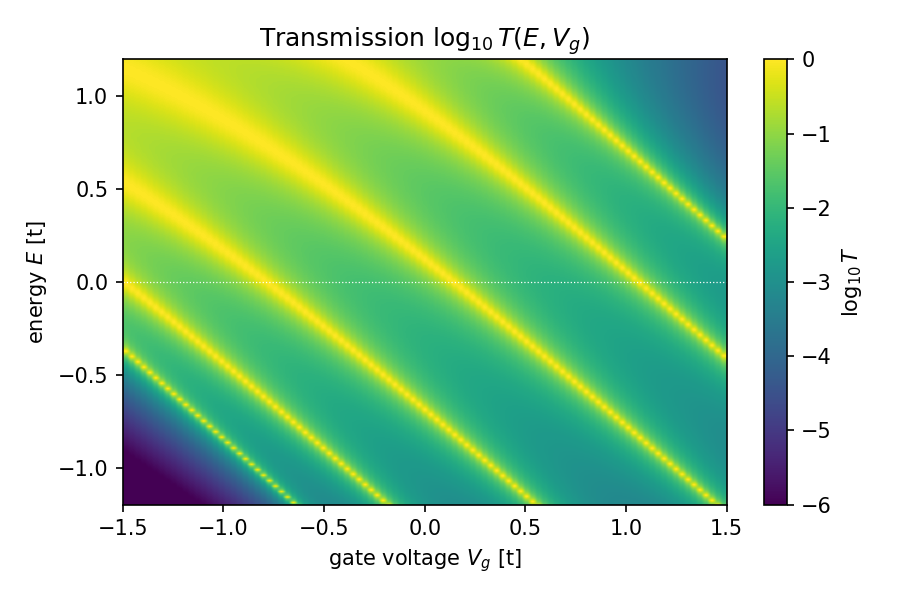
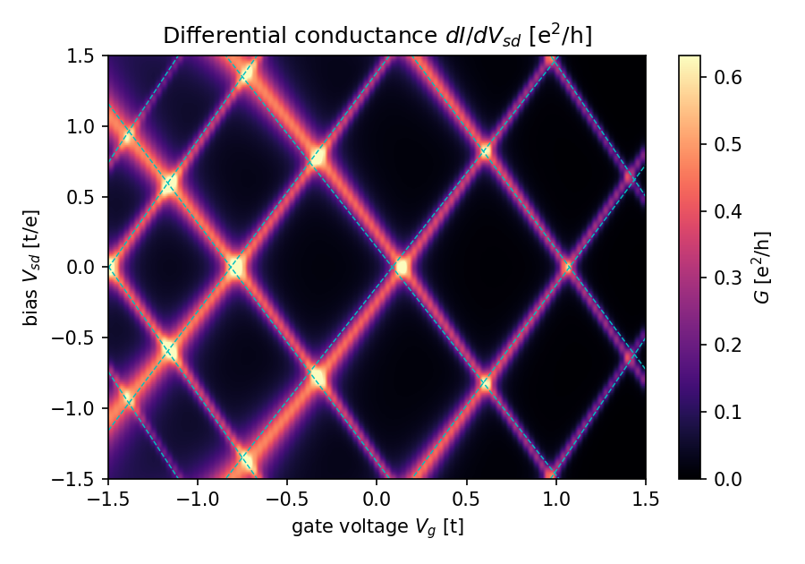
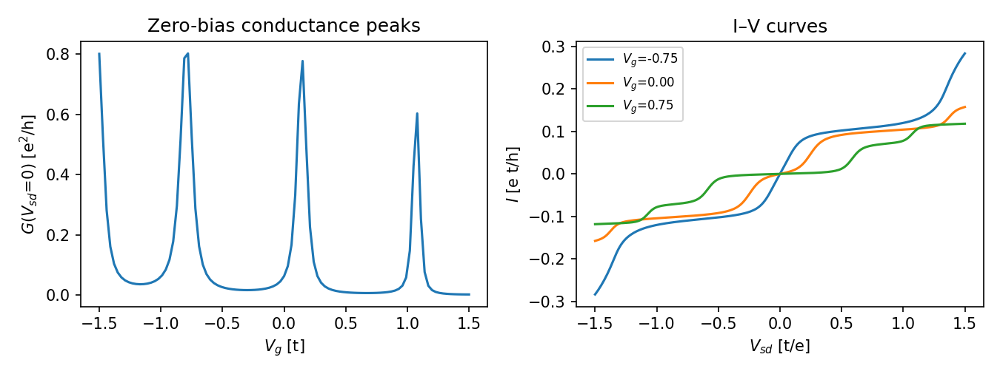

# 量子ドットのゲート電圧–バイアス マップ(クーロンダイヤモンド風)

## 1. 目的
1次元ナノワイヤ中の二重障壁量子ドットについて、ゲート電圧 $V_g$ とソース・ドレイン間バイアス $V_{sd}$ に対する微分コンダクタンス $G=dI/dV_{sd}$ のマップを計算し、ダイヤモンド状の構造が現れることを確認する。

## 2. モデルと手法
- 強束縛鎖 $H=\sum_i\varepsilon_i|i\rangle\langle i|-t\sum_i(|i\rangle\langle i+1|+\text{h.c.})$(以降 $t=1$)、両端に半無限リードを接続(Kwant 1.5.0)。
- ドット: 井戸 6 サイト、両側に障壁(幅 2 サイト、高さ $V_0=2t$)。
- ゲート: 井戸内のオンサイトエネルギーを $-\alpha V_g$($\alpha=1$)だけシフト。障壁は固定。
- 電流(Landauer–Büttiker、$e=h=1$): 
  $I(V_g,V_{sd})=\int T(E;V_g)\,[f(E-V_{sd}/2)-f(E+V_{sd}/2)]\,dE$、$G=dI/dV_{sd}$。
- パラメータ: $k_BT=0.01t$、$V_g\in[-1.5,1.5]$(101点)、$E\in[-1.2,1.2]$(801点)、$V_{sd}\in[-1.5,1.5]$(241点)。
- 再現: `python transport/gate_map.py --nVg 101 --nE 801` → `python transport/gate_map_plots.py report`(4コアで約5分)。

## 3. 結果

### 3.1 透過率 $T(E,V_g)$

共鳴準位が $V_g$ に対して右下がりの直線(傾き $\approx -0.89$)として並ぶ。共鳴幅は準位が高いほど広い(障壁が相対的に低くなるため)。

### 3.2 微分コンダクタンス $dI/dV_{sd}$

各共鳴が $\mu_L=V_{sd}/2$ または $\mu_R=-V_{sd}/2$ と交わる位置で $G$ の稜線が立ち、傾き $\pm2$ 程度の稜線で囲まれたダイヤモンド状の低コンダクタンス領域(電流が流れない領域)が並ぶ。破線(シアン)は $T$ マップの共鳴位置から予測した稜線 $V_{sd}=\pm2E_\mathrm{res}(V_g)$ で、計算された稜線とよく一致している。稜線の交点($V_{sd}=0$)がゼロバイアスのコンダクタンスピークである。

### 3.3 ゼロバイアスのピークと I–V

ゼロバイアスのピークは $V_g=-0.78,\ 0.15,\ 1.08$ にあり、間隔は約 0.93。I–V は準位がバイアス窓に入るたびに階段状に立ち上がる(共鳴トンネル)。

### 3.4 定量チェック(`report/stats.json`)
| 量 | 値 |
|---|---|
| 検出した共鳴準位数 | 6 |
| 共鳴線 $E_\mathrm{res}=c_n+s\,V_g$ の傾き $s$ | $-0.89\pm0.06$ |
| 稜線位置 / $2\lvert E_\mathrm{res}\rvert$ の中央値 | 1.02 |
| ゼロバイアスのピーク高さ(最大) | 0.80 $e^2/h$ |

- 稜線位置が $2|E_\mathrm{res}|$ と 2% で一致することから、ダイヤモンドの形は Landauer 公式で決まる共鳴と窓の交差だけで説明できる。
- 傾きが $-1$ でなく $-0.89$ なのは、固定された障壁内へ波動関数が染み出し、実効的なゲートのレバーアーム(ゲート効率)が 1 より小さくなるため。

## 4. 制限・注意
- **非相互作用モデルであり、クーロン遮蔽(充電エネルギー $E_C$)は含まない**。したがって得られるのは単一粒子共鳴のダイヤモンドで、実際のクーロンダイヤモンドのような $E_C$ による幅の拡大、偶奇効果、電子数の量子化は再現しない。ゲート電圧に依存する平均場(Hartree 型)ポテンシャルを入れれば $E_C$ に相当する効果を取り込める。
- バイアスによる井戸ポテンシャルの変化(電圧降下)は無視した(対称バイアスの窓のみ)。実験で見られるダイヤモンドの左右非対称性はここでは出ない。
- ゼロバイアスのピーク高さ(0.6〜0.8)は $V_g$ 刻み 0.03 と $k_BT=0.01$ に依存し、狭い共鳴の頂点をとらえきれていないため、理論上限の 1 に届いていない。
- 1次元・1軌道・スピン縮退なしで、$G$ は $e^2/h$ 単位(スピン 2 重なら 2 倍)。
